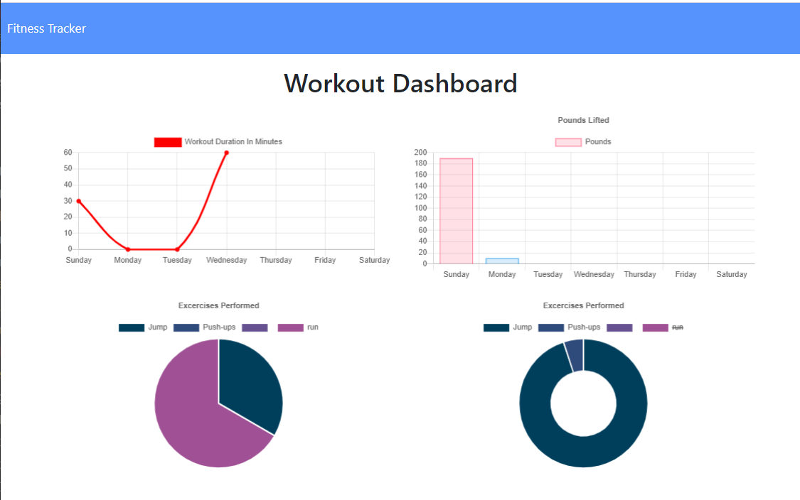

# MongoWOtracker
MongoDB Homework 17 NoSQL Workout Tracker

This is a Fitness Tracker application built with mongoDB, express.js, JavaScript, HTML and CSS.  Designed to store your cardio and resistance workouts after completing them and tracking your progress through the week with a summary display.  This is a fairly simple CRUD based app.

## Technologies Used
mongoDB, mongoose, express.js, html, CSS

## Future Development
* Add the ability to review more historical data.
* Add body weight and BMI trackers.
* Add water consumption and calorie trackers.
* Improve on User Interface and mobile first aspects.

## Link to Application
* [https://mongodb-fitness-tracker.herokuapp.com/](https://mongodb-fitness-tracker.herokuapp.com/)
* [https://github.com/dianecandler/MongoWOtracker](https://github.com/dianecandler/MongoWOtracker)

## User Story

* As a user, I want to be able to view create and track daily workouts. I want to be able to log multiple exercises in a workout on a given day. I should also be able to track the name, type, weight, sets, reps, and duration of exercise. If the exercise is a cardio exercise, I should be able to track my distance traveled.

## Business Context

A consumer will reach their fitness goals quicker when they track their workout progress.

## Acceptance Criteria

When the user loads the page, they should be given the option to create a new workout, or continue with their last workout.

The user should be able to:

  * Add exercises to a previous workout plan.

  * Add new exercises to a new workout plan.

  * View multiple the combined weight of multiple exercises on the `stats` page.LT text

  ## Code provided for exercises

  * Seed code not provided in package.json so could not "npm run seed"
  * Once data is entered in under "Complete" not as a "Continue", data is entered on the next day.  Code provided for this.  Not comfortable with this but using program provided and completing MVP for assignment.